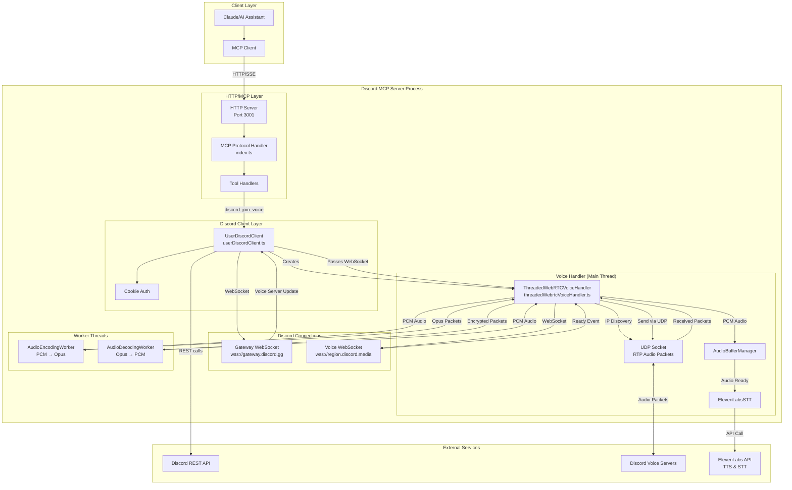
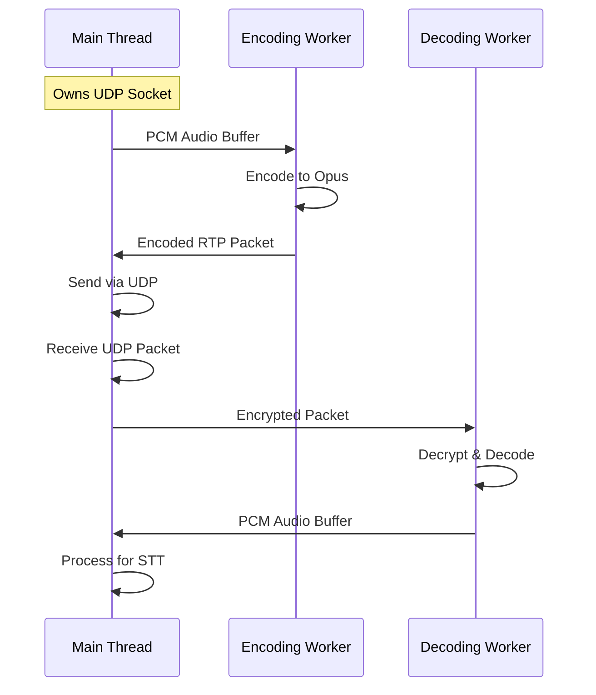

# Discord MCP Architecture

## System Overview

The Discord MCP server implements a multi-threaded architecture for efficient voice channel processing with real-time speech-to-text and text-to-speech capabilities.



## Component Details

### 1. MCP Server (index.ts)
- **Purpose**: Main entry point, HTTP server, and MCP protocol implementation
- **Responsibilities**:
  - Handle MCP tool calls
  - Manage Discord client instance
  - Route commands to appropriate handlers
  - Maintain connection state

### 2. UserDiscordClient (userDiscordClient.ts)
- **Purpose**: Discord gateway connection and state management
- **Key Features**:
  - WebSocket connection to Discord Gateway
  - Authentication with cookie/credentials
  - Guild and channel state management
  - Voice state tracking
  - Message handling

### 3. ThreadedWebRTCVoiceHandler (threadedWebrtcVoiceHandler.ts)
- **Purpose**: Voice channel connection and audio pipeline
- **Architecture**:
  ```
  Main Thread:
    - WebSocket voice connection
    - UDP socket for audio packets
    - Event coordination
    
  Worker Threads:
    - AudioEncodingWorker: PCM → Opus encoding
    - AudioDecodingWorker: Opus → PCM decoding
  ```

### 4. Audio Flow

#### Outgoing Audio (TTS):
```
Text Input → ElevenLabs TTS → PCM Audio → Encoding Worker → Opus → 
RTP Packet → Encryption → UDP Socket → Discord Voice Server
```

#### Incoming Audio (STT):
```
Discord Voice Server → UDP Socket → Decryption → RTP Packet → 
Decoding Worker → Opus → PCM → Audio Buffer Manager → 
ElevenLabs STT → Transcription
```

### 5. Worker Thread Communication



## Key Classes and Interfaces

### AudioEncodingWorker
- Receives PCM audio buffers
- Encodes to Opus format
- Creates RTP packets
- Returns encrypted packets

### AudioDecodingWorker
- Receives encrypted RTP packets
- Decrypts with xsalsa20_poly1305_lite
- Decodes Opus to PCM
- Returns audio buffers

### AudioBufferManager
- Buffers incoming audio by user
- Implements time-based flushing
- Emits 'audioReady' events
- Manages silence detection

### ElevenLabsSTT
- Handles speech-to-text API calls
- Supports word-level timestamps
- Manages API authentication

## Connection Flow

### 1. Discord Login & Gateway Connection
```
1. MCP Client calls discord_connect tool
2. UserDiscordClient uses saved cookie for auth
3. Connects to wss://gateway.discord.gg
4. Receives READY event with user info
5. Starts heartbeat to maintain connection
```

### 2. Voice Channel Join Sequence
```
1. MCP Client calls discord_join_voice with guildId & channelId
2. UserDiscordClient sends Voice State Update to Gateway
3. Gateway responds with Voice Server Update:
   - endpoint: "region1234.discord.media:443"
   - token: "voice_auth_token"
   - guild_id: "guild_id"
4. UserDiscordClient creates ThreadedWebRTCVoiceHandler
5. Connects to voice WebSocket at endpoint
6. Sends Voice Identify (op: 0) with token
7. Receives Voice Ready (op: 2) with:
   - ssrc: audio stream identifier
   - ip: server IP
   - port: UDP port
   - modes: encryption modes
```

### 3. Voice Connection Establishment
```
1. VoiceHandler creates UDP socket
2. Performs IP Discovery:
   - Sends discovery packet to server
   - Receives our external IP/port
3. Sends Select Protocol (op: 1) with:
   - protocol: "udp"
   - address: discovered IP
   - port: discovered port
   - mode: "xsalsa20_poly1305_lite"
4. Receives Session Description (op: 4) with:
   - secret_key: encryption key
5. Initializes worker threads with encryption
```

### 4. Audio Flow - Outgoing (TTS)
```
1. voice_speak tool called with text
2. ElevenLabs TTS generates PCM audio
3. PCM sent to AudioEncodingWorker
4. Worker encodes to Opus format
5. Creates RTP packet with:
   - sequence number
   - timestamp
   - SSRC
6. Encrypts with xsalsa20_poly1305_lite
7. Sends via UDP socket to Discord
```

### 5. Audio Flow - Incoming (STT)
```
1. UDP socket receives encrypted RTP packet
2. VoiceHandler logs: "UDP packet received!"
3. Sends to AudioDecodingWorker
4. Worker decrypts packet
5. Decodes Opus to PCM
6. Returns PCM audio buffer
7. AudioBufferManager accumulates audio
8. When buffer ready, sends to ElevenLabsSTT
9. Transcription event emitted
```

## Configuration

### Environment Variables:
- `DISCORD_USER_COOKIE`: Authentication cookie
- `ELEVENLABS_API_KEY`: TTS/STT API key
- `ELEVENLABS_VOICE_ID`: Voice selection

### Port Configuration:
- HTTP Server: 3001
- UDP: Dynamic (assigned by Discord)

## Current Issues & Debug Points

### 1. Voice Handler Not Initializing
- ✅ ThreadedWebRTCVoiceHandler constructor called
- ✅ Workers created in constructor
- ✅ connect() method called with WebSocket
- ❌ No debug logs appearing in file
- ❌ UDP packets not being logged

### 2. Logging Issues
- Console.error() calls not appearing in discord-mcp.log
- stderr redirection via `2>&1` in npm script
- Added file-based debug logging but file not created
- Process might be failing before handler initialization

### 3. Unused Files (To Be Cleaned)
- `webrtcVoiceHandler.ts` - old implementation
- `simpleVoiceHandler.ts` - unused alternative
- `localVoiceHandler.ts` - imported but never used
- `convertPackets*.ts` - test/debug scripts
- `realtimeTranscriptHandler.ts` - old transcription approach
- `opusStreamHandler.ts` - alternative streaming method

## Error Handling

- WebSocket reconnection logic
- Worker thread restart on failure
- Audio buffer overflow protection
- API rate limit handling

## Security

- xsalsa20_poly1305_lite encryption for voice
- Secure cookie storage
- Environment variable protection
- No credential logging